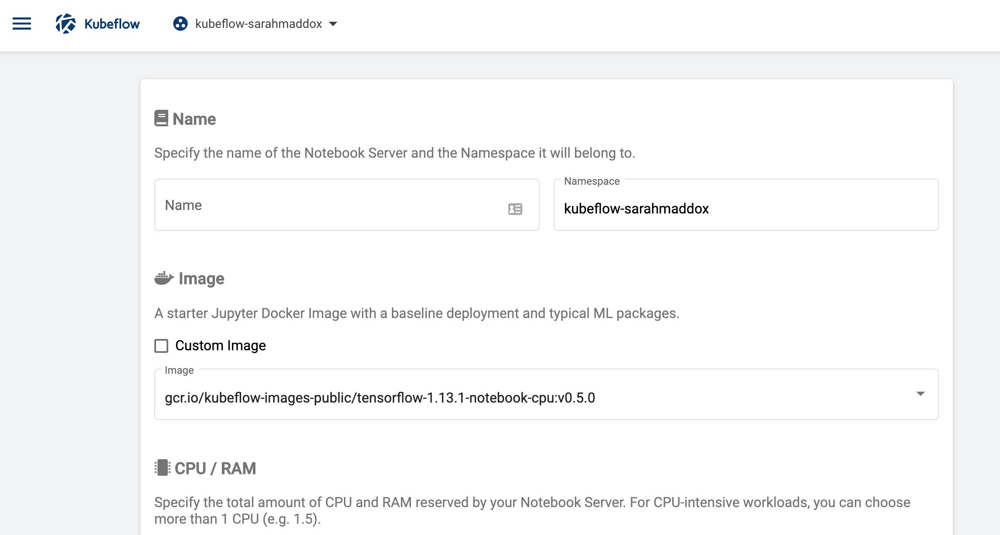
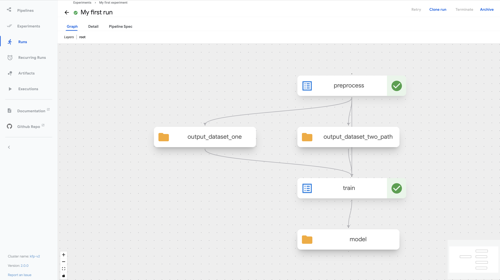
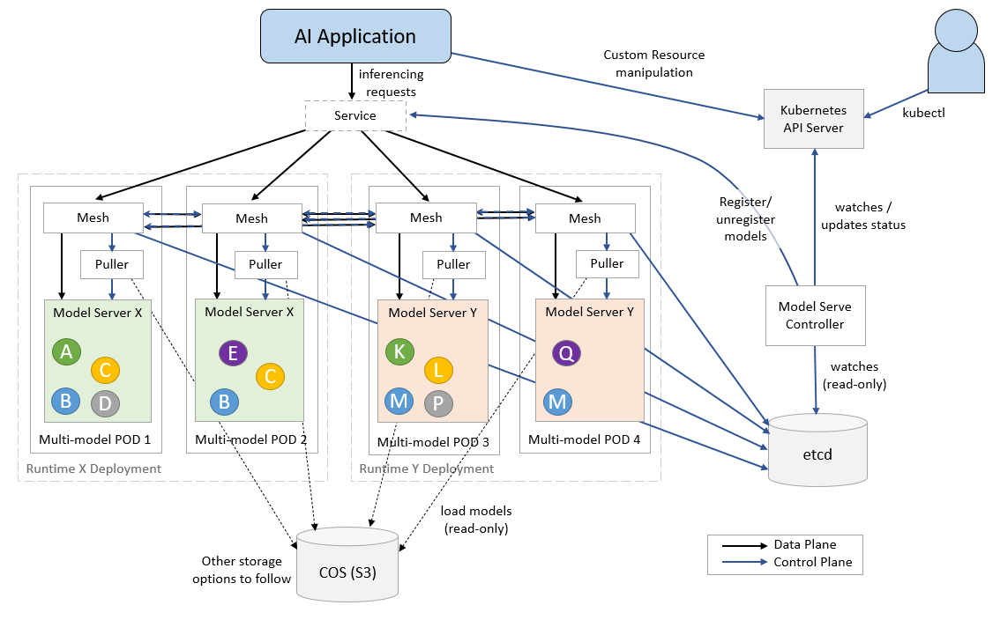

# Kubeflow Lab


## Install

### With official manifest

```
git submodule update --remote
cd kubeflow-manifests
while ! kustomize build example | kubectl apply -f -; do echo "Retrying to apply resources"; sleep 10; done
```

### Connect to your Kubeflow Cluster

After installation, it will take some time for all Pods to become ready. Make sure all Pods are ready before trying to connect, otherwise you might get unexpected errors. To check that all Kubeflow-related Pods are ready, use the following commands:

```sh
kubectl get pods -n cert-manager
kubectl get pods -n istio-system
kubectl get pods -n auth
kubectl get pods -n knative-eventing
kubectl get pods -n knative-serving
kubectl get pods -n kubeflow
kubectl get pods -n kubeflow-user-example-com
```

#### Port-Forward

The default way of accessing Kubeflow is via port-forward. This enables you to get started quickly without imposing any requirements on your environment. Run the following to port-forward Istio's Ingress-Gateway to local port `8080`:

```sh
kubectl port-forward svc/istio-ingressgateway -n istio-system 8080:80
```

After running the command, you can access the Kubeflow Central Dashboard by doing the following:

1. Open your browser and visit `http://localhost:8080`. You should get the Dex login screen.
2. Login with the default user's credential. The default email address is `user@example.com` and the default password is `12341234`.

#### NodePort / LoadBalancer / Ingress

In order to connect to Kubeflow using NodePort / LoadBalancer / Ingress, you need to setup HTTPS. The reason is that many of our web apps (e.g., Tensorboard Web App, Jupyter Web App, Katib UI) use [Secure Cookies](https://developer.mozilla.org/en-US/docs/Web/HTTP/Cookies#restrict_access_to_cookies), so accessing Kubeflow with HTTP over a non-localhost domain does not work.

Exposing your Kubeflow cluster with proper HTTPS is a process heavily dependent on your environment. For this reason, please take a look at the available [Kubeflow distributions](https://www.kubeflow.org/docs/started/installing-kubeflow/#install-a-packaged-kubeflow-distribution), which are targeted to specific environments, and select the one that fits your needs.

---
**NOTE**

If you absolutely need to expose Kubeflow over HTTP, you can disable the `Secure Cookies` feature by setting the `APP_SECURE_COOKIES` environment variable to `false` in every relevant web app. This is not recommended, as it poses security risks.

---

### Change default user password

For security reasons, we don't want to use the default password for the default Kubeflow user when installing in security-sensitive environments. Instead, you should define your own password before deploying. To define a password for the default user:

1. Pick a password for the default user, with email `user@example.com`, and hash it using `bcrypt`:

    ```sh
    python3 -c 'from passlib.hash import bcrypt; import getpass; print(bcrypt.using(rounds=12, ident="2y").hash(getpass.getpass()))'
    ```

2. Edit `common/dex/base/config-map.yaml` and fill the relevant field with the hash of the password you chose:

    ```yaml
    ...
      staticPasswords:
      - email: user@example.com
        hash: <enter the generated hash here>
    ```

### [Not recommended] ~~With Helm Charts~~
~~see [helm-charts/README.md](./helm-charts/README.md)~~

## Usage

> Please see instructions from [Kubeflow](https://www.kubeflow.org/docs) official docs:

#### Training - Distributed training with PyTorch

<a href="https://www.kubeflow.org/docs/components/training/overview/#distributed-training-for-tensorflow">
  
</a>

#### Notebooks
<a href="https://www.kubeflow.org/docs/components/notebooks/quickstart-guide/">
  
</a>

#### Pipelines
<a href="https://www.kubeflow.org/docs/components/pipelines/v2/installation/quickstart/">
  
</a>

#### Serving
<a href="https://kserve.github.io/website/0.11/modelserving/mms/multi-model-serving/">
  
</a>